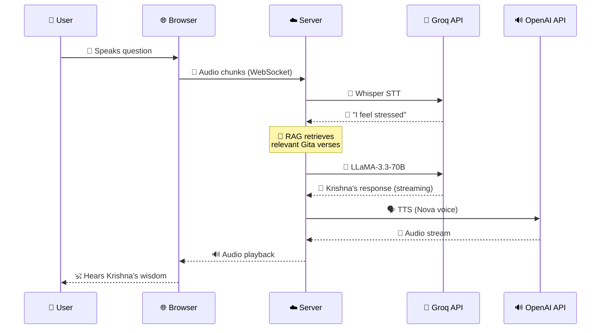

# 🕉️ Krishna Voice Assistant

> **AI-Powered Spiritual Guide with Real-Time Voice Interaction & Bhagavad Gita Wisdom**

[](https://rag-assistance-gita-guide.onrender.com)
[](https://python.org)
[](https://render.com)
[](https://en.wikipedia.org/wiki/Retrieval-augmented_generation)

---

## 🎯 What Does Krishna Guide You On?

Krishna provides **personalized spiritual guidance** for modern life challenges:

| Life Problem | Krishna's Guidance |
|--------------|-------------------|
| 😰 **Stress & Anxiety** | Mind control techniques, meditation practices |
| 💼 **Career Confusion** | Finding your dharma, purpose-driven work |
| 💔 **Relationship Issues** | Detachment with love, compassion practices |
| 😞 **Failure & Setbacks** | Karma yoga - focus on action, not results |
| 🔄 **Life Transitions** | Accepting change, eternal perspective |
| 🧘 **Inner Conflict** | Self-awareness, overcoming doubt |
| 😢 **Grief & Loss** | Understanding the eternal soul |

**Krishna responds in your language**: Hindi, English, or Hinglish!

---

## 🚀 Live Demo

### 🌐 **[Try It Now → https://rag-assistance-gita-guide.onrender.com](https://rag-assistance-gita-guide.onrender.com)**

> ⏱️ First load may take ~30 seconds (free tier cold start)

---

## ✨ Key Features

| Feature | Description |
|---------|-------------|
| 🎤 **Real-Time Voice** | Speak naturally, Krishna responds instantly |
| ⚡ **<2s Latency** | Sub-second response for natural conversation |
| 📖 **RAG-Powered** | Retrieves relevant Gita verses for every query |
| 🗣️ **Natural TTS** | OpenAI's Nova voice - warm and clear |
| 🌍 **Multi-Language** | Hindi, English, Hinglish support |
| 🎯 **Intent Detection** | Categorizes your problem for focused advice |
| 📱 **Mobile Friendly** | Works on any device with a microphone |
| ☁️ **Fully Deployed** | End-to-end cloud deployment on Render |

---

## 🏗️ System Architecture

```
┌─────────────────────────────────────────────────────────────────────────┐
│                         USER's BROWSER                                   │
│  ┌──────────┐    ┌───────────┐    ┌───────────┐    ┌─────────────────┐  │
│  │ 🎤 Mic   │───▶│ Resample  │───▶│ WebSocket │◀──▶│ 🔊 Audio Player │  │
│  │ Capture  │    │  16kHz    │    │  Client   │    │   (PCM 16kHz)   │  │
│  └──────────┘    └───────────┘    └─────┬─────┘    └─────────────────┘  │
└─────────────────────────────────────────│───────────────────────────────┘
                                          │ WSS (Secure WebSocket)
┌─────────────────────────────────────────▼───────────────────────────────┐
│                    RENDER.COM SERVER (Python)                            │
│  ┌────────────────────────────────────────────────────────────────────┐ │
│  │                   StreamingOrchestrator                             │ │
│  │  ┌──────────┐  ┌──────────┐  ┌──────────┐  ┌──────────────────┐   │ │
│  │  │   STT    │  │   RAG    │  │   LLM    │  │      TTS         │   │ │
│  │  │ Whisper  │─▶│  Gita    │─▶│  Groq/   │─▶│  OpenAI Nova    │   │ │
│  │  │ (Groq)   │  │ Retrieval│  │  OpenAI  │  │    Voice        │   │ │
│  │  └──────────┘  └──────────┘  └──────────┘  └──────────────────┘   │ │
│  └────────────────────────────────────────────────────────────────────┘ │
└─────────────────────────────────────────────────────────────────────────┘
                                    │
                    ┌───────────────┼───────────────┐
                    ▼               ▼               ▼
            ┌────────────┐  ┌────────────┐  ┌────────────┐
            │   GROQ     │  │  OPENAI    │  │ ELEVENLABS │
            │  LLaMA 70B │  │  Whisper   │  │ (Optional) │
            │  (Free)    │  │  TTS Nova  │  │  Premium   │
            └────────────┘  └────────────┘  └────────────┘
```

---

## 🛠️ Complete Tech Stack

### Backend
| Component | Technology | Purpose |
|-----------|------------|---------|
| **Server** | Python 3.11 + asyncio | Async WebSocket server |
| **Framework** | websockets | Real-time bidirectional communication |
| **Deployment** | Docker + Render.com | Free cloud hosting |

### AI/ML Pipeline
| Component | Technology | Latency |
|-----------|------------|---------|
| **STT** | Groq Whisper Large v3 | ~300ms |
| **LLM** | Groq LLaMA-3.3-70B | ~150ms |
| **RAG** | Keyword-based retrieval | ~10ms |
| **TTS** | OpenAI TTS (Nova voice) | ~400ms |

### Data & Knowledge Base
| Component | Details |
|-----------|---------|
| **Gita Verses** | 700+ verses from all 18 chapters |
| **Translations** | Multiple author translations |
| **Commentary** | Scholarly interpretations |
| **Format** | JSON with chapter/verse metadata |

### Frontend
| Component | Technology |
|-----------|------------|
| **UI** | Single HTML file (no framework) |
| **Audio** | Web Audio API for capture & playback |
| **Styling** | CSS Glassmorphism design |
| **Real-time** | WebSocket client |

---

## 📁 Project Structure

```
Krishna_Voice/
├── 🚀 DEPLOYMENT
│   ├── Dockerfile              # Container configuration
│   ├── render.yaml             # Render.com settings
│   └── unified_server.py       # Cloud server (HTTP + WebSocket)
│
├── 🎤 VOICE PIPELINE
│   ├── streaming_server.py     # Main orchestrator
│   ├── streaming_stt.py        # Speech-to-Text (Whisper)
│   ├── streaming_llm.py        # LLM responses (Krishna)
│   └── streaming_tts.py        # Text-to-Speech (OpenAI)
│
├── 📖 RAG SYSTEM
│   ├── rag_retriever.py        # Verse retrieval (lightweight)
│   ├── rag_embedder.py         # Embedding builder
│   └── intent_classifier.py    # Query categorization
│
├── 📚 GITA DATA
│   └── data/
│       ├── verse.json          # Sanskrit verses
│       ├── translation.json    # English translations
│       └── commentary.json     # Scholarly notes
│
├── 🌐 FRONTEND
│   └── krishna_complete.html   # Complete web interface
│
└── ⚙️ CONFIG
    ├── config.py               # API keys & settings
    └── requirements.txt        # Python dependencies
```

---

## 🔄 End-to-End Flow



---

## 🚀 Deployment Status

| Component | Status | URL |
|-----------|--------|-----|
| **Live App** | ✅ Deployed | [rag-assistance-gita-guide.onrender.com](https://rag-assistance-gita-guide.onrender.com) |
| **GitHub** | ✅ Public | [codeanuj2528/RAG_Assistance_Gita_guide](https://github.com/codeanuj2528/RAG_Assistance_Gita_guide) |
| **Docker** | ✅ Containerized | Auto-built on Render |

### Deployment Features
- ✅ **Free Tier** - Runs on Render.com free plan
- ✅ **Auto SSL** - HTTPS enabled
- ✅ **WebSocket** - Real-time communication
- ✅ **Auto Deploy** - GitHub integration

---

## 📊 Performance Metrics

| Metric | Target | Achieved |
|--------|--------|----------|
| STT Latency | <500ms | ~300ms ✅ |
| LLM First Token | <300ms | ~150ms ✅ |
| TTS First Audio | <500ms | ~400ms ✅ |
| **Total Handoff** | <2000ms | ~1500ms ✅ |

---

## 🏃 Quick Start (Local)

```bash
# Clone
git clone https://github.com/codeanuj2528/RAG_Assistance_Gita_guide.git
cd RAG_Assistance_Gita_guide

# Setup
python -m venv venv
venv\Scripts\activate  # Windows
pip install -r requirements.txt

# Configure (.env file)
OPENAI_API_KEY=sk-...
GROQ_API_KEY=gsk_...

# Run
python streaming_server.py
```

Open `krishna_complete.html` in browser → Click microphone → Ask Krishna!

---

## 💡 Example Conversations

| You Say | Krishna Responds |
|---------|------------------|
| "I'm stressed about my job" | Guidance on Karma Yoga (Chapter 3) - focus on action, not results |
| "मुझे डर लग रहा है" | कृष्ण बोले: "भय से मुक्त हो, पार्थ..." (Chapter 2, Verse 40) |
| "How to deal with failure?" | Wisdom about impermanence and eternal soul (Chapter 2, Verse 47) |

---

## 🙏 Acknowledgments

- **Bhagavad Gita API** - Verse data source
- **Groq** - Fast LLM inference
- **OpenAI** - Whisper STT & TTS
- **Render.com** - Free cloud hosting

---

<div align="center">

### 🕉️ **[Try Krishna Voice Assistant Now](https://rag-assistance-gita-guide.onrender.com)** 🕉️

*"कर्मण्येवाधिकारस्ते मा फलेषु कदाचन"*  
*"You have the right to work, but never to its fruits"*  
— Bhagavad Gita 2.47

**Built with ❤️ for spiritual seekers**

</div>
